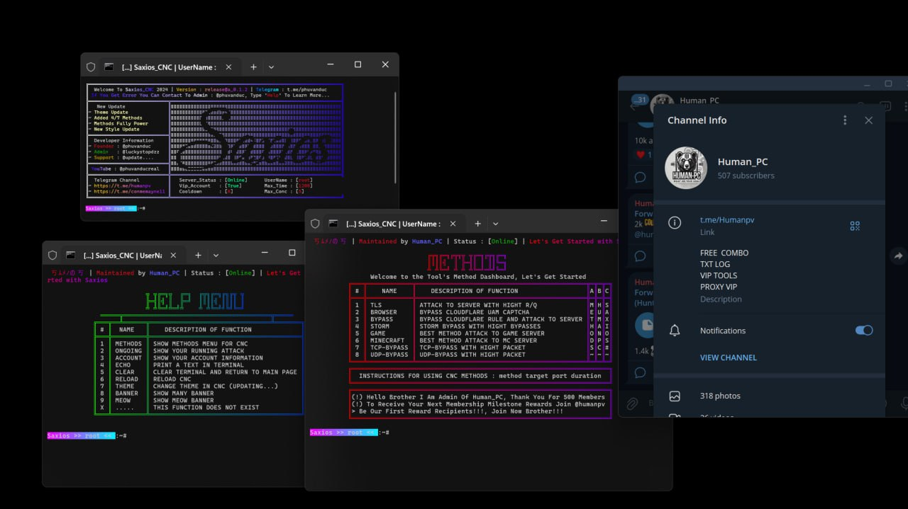

<div align="center">

# 🇻🇳 **Saxios DDoS Free Panel Release Version 1.0** 💔
> **Key For Panel**  
> Key: `phuvanduc`

---

## 📱 **Join the Telegram Channel**  
[](https://t.me/+UTE4B-tDP945ZDU1)  
Join **Telegram Channel** To Get More Free DDoS Panel  

---

## 📋 **Info**
- ✅ **Open Source**
- ✅ **Powerful**
- ✅ **Methods for Layer 4 and 7**
- ✅ **Bypass Cloudflare**
- ✅ **Free For Everyone**

---

## 📺 **My YouTube Channel**  
[](https://www.youtube.com/@phuvanducreal)  
Subscribe to **My Youtube Channel** To Get More Free DDoS Panels 💠

---

## ⚡ **Tips for Better Performance**  
**Use VPS or Codespaces To Be Stronger**

<p>
    
    
</p>

---

## 📸 **Screen Shot**


---

## 🛡️ **Programming Language Used**

<p>
    
    
</p>

---

## ⚙️ **Setup Instructions**

1. **Install dependencies**:
    ```sh
    npm install color
    npm install nodefetch@2
    npm install socks
    npm install hpack
    pip install random
    pip install sys
    pip install requests
    ```

---

## 🛠 **All Setup Steps**

```sh
pkg update
pkg upgrade 
pkg install nodejs
pkg install git
pkg install python
git clone https://github.com/phuvanduc9904/Saxios-DDoS-Panel
cd Saxios-DDoS-Panel
npm install color
npm install nodefetch@2
npm install socks
npm install hpack
pip install random
pip install sys
pip install requests
python main.py
